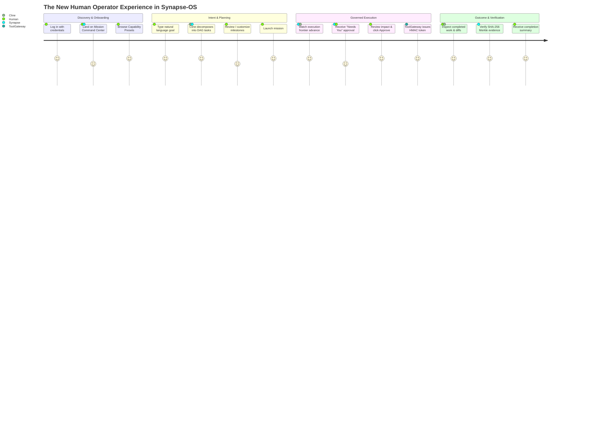

# SYNAPSE-OS — REAL HUMAN-FIRST PRODUCT WALKTHROUGH

**Document**: `docs/human_first_product_walkthrough.md`  
**Date**: 2026-09-03  
**Audience**: First-time Human Operators, AI Systems Architects, Product Leadership  
**System Invariant**:
- **HUMAN**: The authoritative director, approver, and beneficiary.
- **SYNAPSE OS**: Operating system providing identity, multi-tenancy, RBAC, state graph, governance, persistence, and cryptographic audit.
- **CLINE**: Embedded Primary Cognitive Brain responsible for strategy formulation, reasoning, DAG task planning, and tool orchestration.
- **TOOLGATEWAY**: Single, non-bypassable execution boundary enforcing safety policies and HMAC authorization.
- **REAL EXECUTION**: Physical execution on OS, filesystem, APIs, and databases.
- **EVIDENCE / AUDIT**: SHA-256 Merkle chain verification guaranteeing tamper-evident provenance.

---

## 1. The Actual User Journey (Screen-by-Screen)

---

### Step 1: First Login (`/login`)
- **What the user sees**: A clean, modern authentication portal.
- **What they do**: Enter their tenant email and password.
- **What happens behind the scenes**: The client calls `POST /api/v1/auth/login`, receives a signed JWT access token containing tenant and workspace claims, and securely stores the token in memory (`auth.tsx`).
- **Immediate impression**: Feels like a secure enterprise operating console.

---

### Step 2: First Screen — Mission Command Center (`/missions`)
- **What the user sees**:
  - Global TopBar with active workspace indicator (`tenant_human_corp`), realtime WebSocket pulse indicator (`● LIVE`), and Quick Command Palette (`⌘K`).
  - Left navigation sidebar divided into **Missions** (`Command`, `Execution Graph`, `Workforce`), **Governance** (`Approvals`, `Escalations`, `Audit Trail`, `Simulation`), and **Settings** (`Provider Keys`).
  - Top HUD displaying system metrics: Active Missions, Needs You Attention Count, Active Agents, and Live Cost.
- **"What should I do?"**:
  - If no missions exist, a prominent hero Empty State appears: *"Start a new autonomous mission with natural language or choose from preset capability templates"* with a bright cyan **`Launch Your First Mission`** button.
  - The top bar also hosts a persistent **`+ New Mission`** button.
  - There are zero dead ends.

---

### Step 3: Creating the First Mission (`NewMissionModal`)
- **How it works**:
  - The user clicks **`+ New Mission`** or **`Launch Your First Mission`**.
  - A modal opens with **6 Intent Presets**:
    1. 🛡️ *Security & Vulnerability Audit* (MEDIUM RISK)
    2. 🐛 *Bug Diagnosis & Targeted Repair* (LOW RISK)
    3. ⚡ *Database & SQL Performance* (HIGH RISK)
    4. 🚀 *Feature Implementation & API Design* (MEDIUM RISK)
    5. 🧪 *Autonomous Test Suite Generator* (LOW RISK)
    6. 🧹 *Code Refactoring & Typing Hardening* (LOW RISK)
  - Or the user writes a custom goal in the prompt textarea:
    > *"Audit authentication middleware in apps/backend and patch unprotected routes."*
- **Cline's Immediate Contribution**:
  - The user sees a live **"Cline Proposed Plan Decomposition"** preview breaking down the intent into sequenced milestones.
  - The user can add custom requirements or remove unwanted steps before launching.
  - The user clicks **`Launch Mission`**.

---

### Step 4: Mission Cockpit & Live Execution (`/missions/:id`)
- **What the user sees**:
  - **Left Column**:
    - **Interactive Live DAG**: Visual nodes showing task states (`CREATED`, `QUEUED`, `RUNNING`, `COMPLETED`, `FAILED`). Active nodes pulse emerald; the execution frontier is illuminated.
    - **Live Activity Stream**: Real-time event log streaming events from Cline and Synapse.
    - **Human Operator Guidance & Interventions Console**: Direct text box allowing the human to guide Cline mid-flight (*"Also run unit tests", "Skip step 2"*).
  - **Right Column**:
    - **Cline Primary Brain HUD**: Displays Cline's *Mission Objective*, *Current Status*, and *Next Step*.
    - **Governance & Approvals ("Needs You")**: Displays active approvals holding execution.
    - **Prediction vs Reality**: Accuracy telemetry from Digital Twin simulations.
- **Human Controls**:
  - `Pause`: Halts frontier progression safely without terminating runtime.
  - `Resume`: Resumes active execution.
  - `Stop Mission`: Emergency cancellation and sandbox deallocation.

---

### Step 5: The "Needs You" Human Approval Moment (`/approvals` or Cockpit)
- **When it triggers**: When Cline requests a destructive or high-risk tool (e.g. `kernel_config_patch`, `drop_database_table`, `write_to_file` in production directories).
- **The Human Experience**:
  - A pulsing gold **"1 NEED YOU"** notification appears in the TopBar and Cockpit.
  - The human opens the approval request.
  - The approval explains:
    - Tool name and exact proposed parameters.
    - Why the tool is gated under policy.
    - Risk rating (`MEDIUM`, `HIGH`, `CRITICAL`).
    - Recommendation: Approve or Reject.
  - The human clicks **`Approve`** (or **`Reject`** with optional feedback).
- **ToolGateway Invariant**: ToolGateway verifies the HMAC signature, confirms the approver's RBAC permissions, and issues a 30-second single-use authorization token. The tool executes physically, and evidence is hashed.

---

### Step 6: Task Failure & Autonomous Recovery
- **What happens if a tool or test fails**:
  - Synapse records the failure honestly in the DAG—no fake green illusions.
  - The node turns red (`FAILED`).
  - Cline receives the failure observation via the event stream.
  - Cline reasons about the root cause and triggers an **OCC Replan** (`V1 -> V2`), inserting a fallback recovery node into the DAG.
  - The operator can also click the failed node in the DAG Inspector to manually trigger **`Retry Task`** or **`Skip This Task`**.

---

### Step 7: Mission Completion & Proof of Completion
- **When all tasks succeed**:
  - The status badge transitions to `COMPLETED`.
  - The Mission Cockpit renders the **Mission Completion Summary**:
    - High-level outcome and list of completed milestones.
    - Files modified and test suites passed.
    - Total execution time, token usage, and cost in USD.
    - Clickable **SHA-256 Merkle Evidence Proof** linking to the immutable audit record.
  - Operator has complete, verified peace of mind that the objective was accomplished.
