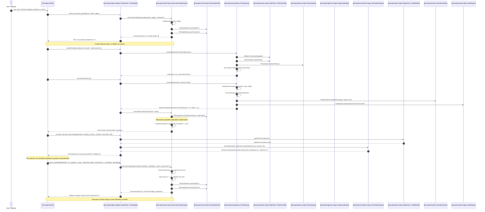

# SYNAPSE-OS — LIVE EXECUTION CALL GRAPH TRACE

## Execution Paradigm Invariant

```
CLINE THINKS.
SYNAPSE CONTROLS.
SIMULATION PREDICTS.
OBSERVATION DESCRIBES REALITY.
GRAPH DETERMINES THE EXECUTION FRONTIER.
TOOL GATEWAY CONTROLS EXECUTION.
HUMAN CAN INTERRUPT.
NOTHING BYPASSES SYNAPSE.
```

---

## Complete End-to-End Live Call Graph

This document details the exact, unbroken production call graph across all Synapse-OS packages and `@cline/core` engine adapter interfaces.



---

## Detailed Step-by-Step Function & Module Manifest

| Step | Subsystem | File / Module | Function / Method | Authoritative Responsibility |
|---|---|---|---|---|
| **1** | `@synapse/engine-adapter` | `packages/engine-adapter/src/graph/GraphTools.ts` | `createSubmitPlanTool.execute()` | Ingests initial Cline structured graph plan and delegates to control plane. |
| **2** | `@synapse/control-plane` | `packages/control-plane/src/graph/ExecutionGraphEngine.ts` | `ExecutionGraphEngine.replan()` | Validates DAG topology, creates deep-cloned immutable version, and advances graph state. |
| **3** | `@synapse/control-plane` | `packages/control-plane/src/graph/GraphStore.ts` | `FileGraphStore.saveGraph()` | Atomically persists graph snapshot and updates latest version pointer on disk. |
| **4** | `@synapse/control-plane` | `packages/control-plane/src/graph/ExecutionGraphEngine.ts` | `ExecutionGraphEngine.getFrontier()` | Computes legal, executable frontier nodes (in-degree 0, `QUEUED`/`CREATED`/`WAITING`). |
| **5** | `@synapse/engine-adapter` | `packages/engine-adapter/src/ClineEngine.ts` | `ClineEngine.handleClineToolApproval()` | Authoritative interception boundary. Prevents native tool execution prior to Synapse governance. |
| **6** | `@synapse/tool-gateway` | `packages/tool-gateway/src/ToolGateway.ts` | `ToolGateway.evaluateAndAuthorizeToolCall()` | Runs precedence pipeline (Multi-Tenant -> KillSwitch -> Risk -> Workspace -> Policy -> Capabilities -> Approvals). |
| **7** | `@synapse/safety-engine` | `packages/safety-engine/src/SafetyEngine.ts` | `SafetyEngine.analyzeRisk()` | Computes risk level, prompt injection risks, and blast radius factor scores. |
| **8** | `@synapse/policy-engine` | `packages/policy-engine/src/PolicyEngine.ts` | `PolicyEngine.evaluatePolicy()` | Evaluates tenant security boundaries, dangerous commands, and approval rules. |
| **9** | `@synapse/tool-gateway` | `packages/tool-gateway/src/ToolGateway.ts` | `ToolGateway.issueAuthorizationToken()` | Creates cryptographically signed HMAC-SHA256 token binding tenant, agent, session, and parameter hash. |
| **10** | `@synapse/engine-adapter` | `packages/engine-adapter/src/ClineEngine.ts` | `createGovernedExecutors.wrapper()` | Intercepts Cline execution invocation and forces execution through `ToolGateway.executeTool()`. |
| **11** | `@synapse/tool-gateway` | `packages/tool-gateway/src/ToolGateway.ts` | `ToolGateway.executeTool()` | Validates token signature, checks replay, executes tool, redacts secrets, seals evidence, and logs audit. |
| **12** | `@synapse/evidence` | `packages/evidence/src/EvidenceStore.ts` | `EvidenceStore.storeEvidence()` | Seals cryptographic Merkle evidence item containing execution parameters, output, and duration. |
| **13** | `@synapse/audit-engine` | `packages/audit-engine/src/AuditEngine.ts` | `AuditEngine.logSecurityEvent()` | Logs immutable audit entry chained with parent cryptographic hash. |
| **14** | `@synapse/control-plane` | `packages/control-plane/src/graph/ExecutionGraphEngine.ts` | `ExecutionGraphEngine.recordObservation()` | Converts verified tool output into trusted `OBSERVED_FACT`s with complete execution provenance. |
| **15** | `@synapse/control-plane` | `packages/control-plane/src/graph/ConditionEvaluator.ts` | `ConditionEvaluator.evaluate()` | Evaluates sandboxed DSL boolean conditions (`==`, `!=`, `>`, `<`, `AND`, `OR`, `NOT`, `()`) over trusted facts. |
| **16** | `@synapse/simulation-engine` | `packages/simulation-engine/src/SimulationEngine.ts` | `SimulationEngine.runMonteCarloSweep()` | Executes discrete-event simulation across isolated twin clone to predict failure rate and blast radius. |
| **17** | `@synapse/control-plane` | `packages/control-plane/src/graph/ExecutionGraphEngine.ts` | `ExecutionGraphEngine.replan()` | Applies Optimistic Concurrency Control (`baseVersion`), generates Graph V2, and isolates V1 snapshot. |

---

## 10 Mandatory Context Correlation IDs

Every live trace and tool execution context captured across Synapse-OS authoritatively carries and verifies all 10 correlation identifiers:

1. `tenantId`: Tenant isolation and workspace boundary identifier.
2. `missionId`: Top-level strategic objective correlation identifier.
3. `taskId`: Canonical DAG task identifier in the control plane state machine.
4. `runId`: Specific execution run identifier.
5. `attemptId`: Attempt counter within the active run.
6. `agentId`: Authoritative agent identity in the Agent Registry.
7. `graphId`: Unique persistent ExecutionGraph identifier.
8. `graphVersion`: Monotonically increasing immutable graph version number.
9. `runtimeId`: Sandboxed runtime instance identifier (Docker, Process, VM).
10. `clineSessionId`: Active Cline session stream correlation identifier.
