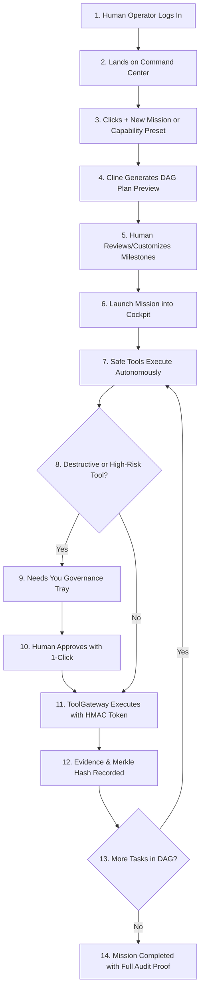

# SYNAPSE-OS — COMPLETE OPERATOR USER JOURNEY

**Document**: `docs/operator_user_journey.md`  
**Date**: 2026-09-01  
**Audience**: Human Operators, Engineering Leads, Product Managers  

---

## 1. Journey Overview: From Login to Verified Mission Outcome

The Synapse Operator journey is designed around **Human Intent $\rightarrow$ Autonomous Reasoned Planning $\rightarrow$ Governed Execution $\rightarrow$ Mathematical Verification**.

---

## 2. Step-by-Step Experience Walkthrough

### Phase 1: Onboarding & First Impression (0–60 Seconds)
1. **Authentication**: Operator signs in via login page.
2. **Dashboard Orientation**: Operator sees the **Mission Command Center** (`/missions`):
   - Active missions, waiting approvals, and active agents.
   - Status of **Cline (Primary Cognitive Brain)**.
   - Prominent **`+ New Mission`** button in the header.

### Phase 2: Intent Expression & Capability Discovery (1–2 Minutes)
1. Operator clicks **`+ New Mission`**.
2. Operator chooses between:
   - **Quick Presets**: 6 core capabilities (Security Audit, Bug Diagnosis, DB Performance, Feature Implementation, Test Generation, Refactoring).
   - **Natural Language Input**: Typing a custom intent (*"Add authentication rate limiting and verify login routes"*).
3. **Cline's Plan Preview**: The modal immediately breaks down the intent into sequenced milestones.
4. **Customization**: Operator can add custom requirements or delete steps.

### Phase 3: Autonomous Execution & Cockpit Monitoring (2–5 Minutes)
1. Operator clicks **`Launch Mission`**.
2. Browser transitions to **Mission Cockpit** (`/missions/:id`).
3. Operator watches the live DAG:
   - **Green Pulsing**: Active node currently executing.
   - **Blue Glow**: Frontier ready for execution.
   - **Tokens & Cost**: Live cost tracker updating in real time.
4. **Cognitive Transparency**: Cline's real-time reasoning box explains *Current Thought*, *Strategy*, and *Next Action*.

### Phase 4: Human Governance & "Needs You" Sign-off
1. When a high-risk tool is proposed (e.g. `kernel_patch`, `execute_sql`, `drop_table`):
   - Execution pauses safely at the ToolGateway boundary.
   - A gold **NEEDS YOU** badge pulses in the Cockpit and Top Bar.
2. Operator inspects the exact tool arguments and risk reason.
3. Operator clicks **`Approve`** (or **`Reject`** with a reason).
4. ToolGateway generates an HMAC-signed token, executes the tool, and resumes the frontier.

### Phase 5: Mid-Flight Intervention & Steering
1. At any point, the operator can type into the **Human Guidance Console**:
   > *"Also run the unit test suite after applying the patch."*
2. Cline receives the instruction and triggers an **OCC (Optimistic Concurrency Control) Replan**, evolving the DAG from `V1` to `V2` without disrupting completed work.

### Phase 6: Mission Completion & Cryptographic Evidence
1. All nodes reach `COMPLETED` state.
2. Operator inspects the final deliverables, diffs, and execution logs.
3. Every step contains a clickable **SHA-256 Merkle Evidence Hash**, mathematically proving that what was reported is what actually ran.
